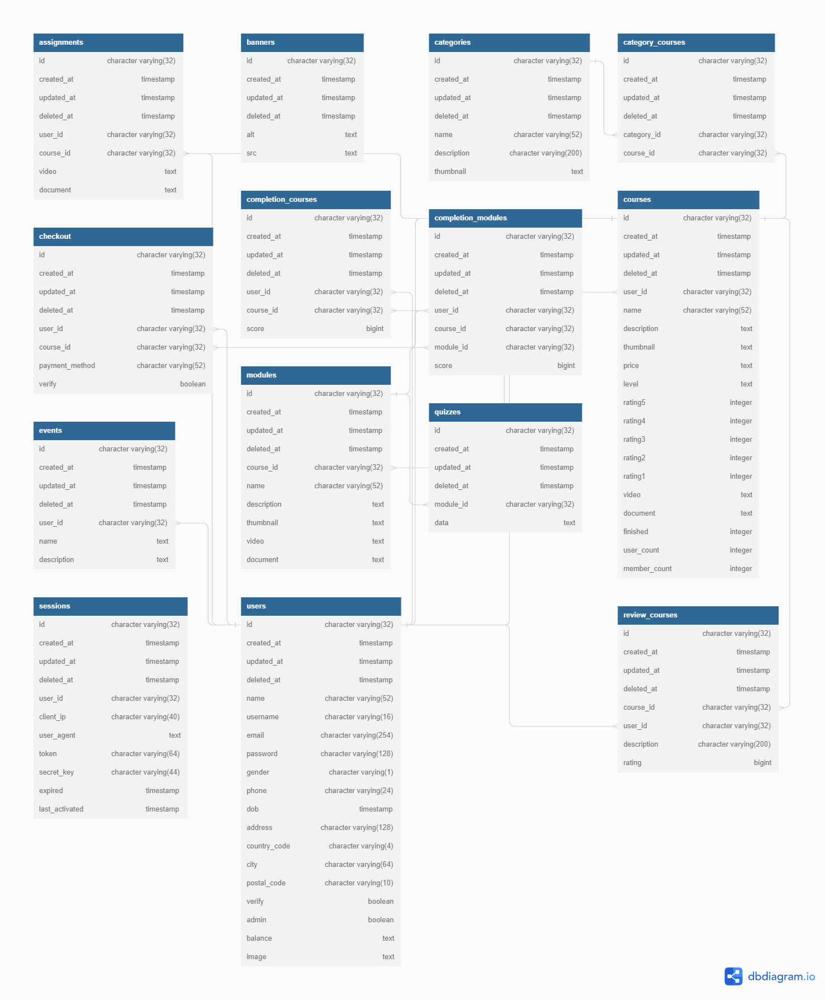

# Academy API
## GO Backend for learning Management System

### Powered by [PapayaNet](https://github.com/skulluglify/papayanet) framework API, the bundling library with Fiber, GORM, Swagger, etc

Features

- Basic Authentication with JWT
- Control Resource Shared (*CORS*)
- Documentation with Swagger (*OpenAPI 3.0*)
- Max Sessions with Index Limiter
- Request Validation

Schema ERD

